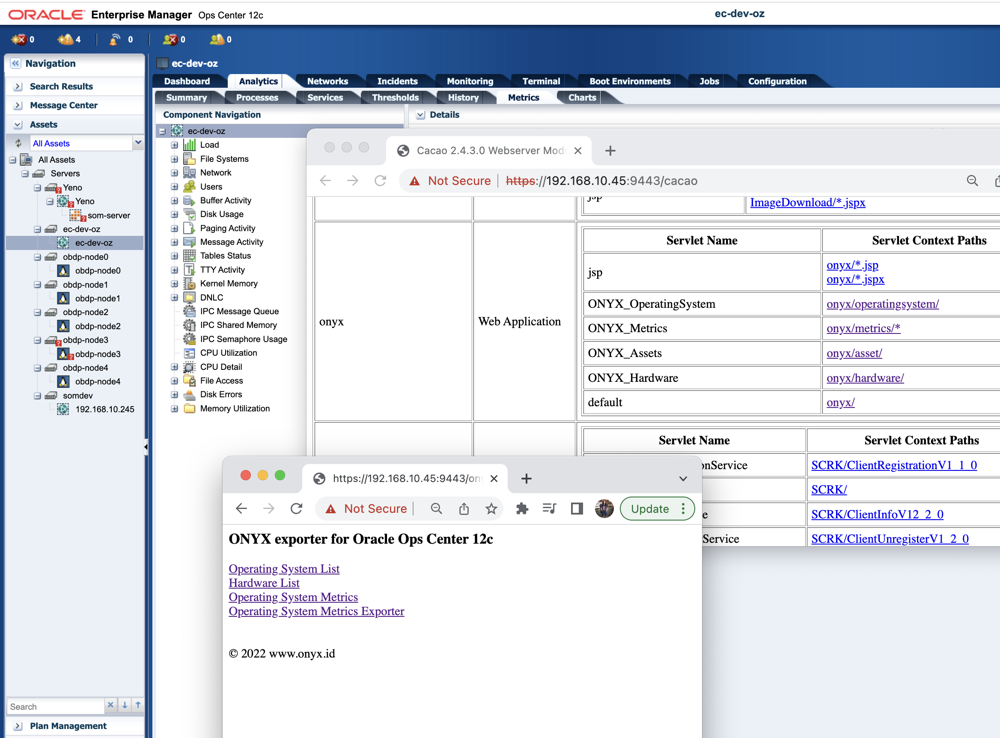
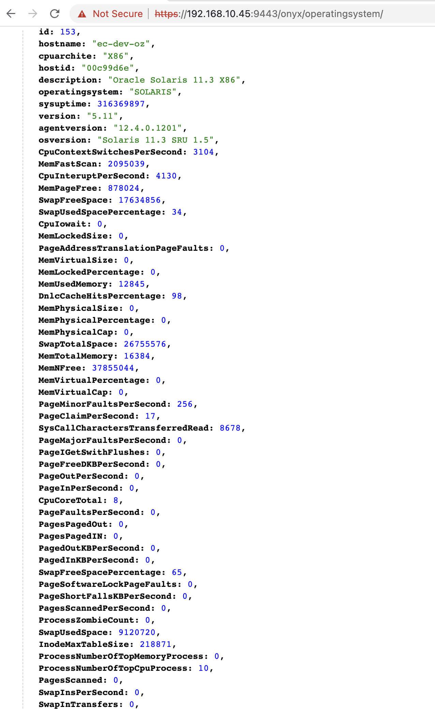
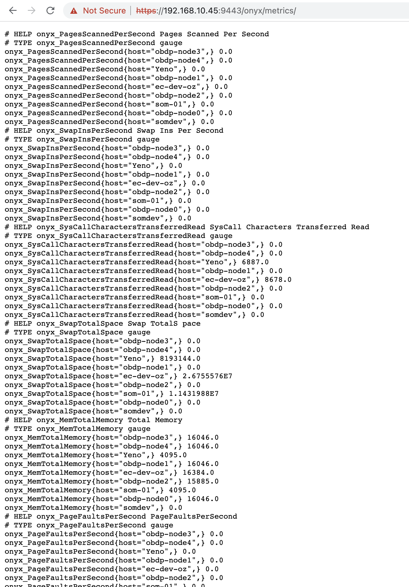
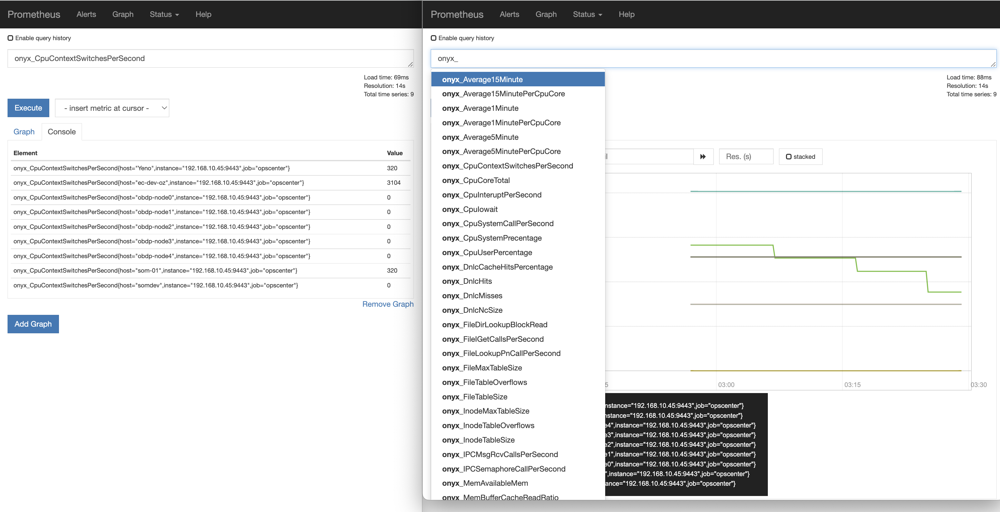

# ONYX Metric Exporter for Oracle OpsCenter 12C

[Change oracleoc password](/notes/001_change-password-oracleoc.md)

[Enable access to Oracle DB/embedded](/notes/002_access-oracleDB-opscenter.md)

[Set Unlimited session to OC user access](/notes/003_update-profile-session.md)

[Set max Process for Onyx Exporter](/notes/004_update-process.md)


NOTES: 
- 3rd development sebagai servlet dengan query pada *view* dan sebagai exporter prometheus java client
- 2nd development sebagai servlet dengan query pada *view*
- 1st development as springboot application


inject dari database




prometheus exporter


graphing with grafana

[sample prometheus config](/notes/prometheus.yml) update interval setiap 60 detik (1 menit)

```yaml
scrape_configs:
  - job_name: 'opscenter'
    scrape_interval: 60s
    scrape_timeout: 60s
    scheme: https
    metrics_path: /onyx/metrics
    tls_config:
      insecure_skip_verify: true
    static_configs:
      - targets: ['192.168.10.45:9443']
```      
