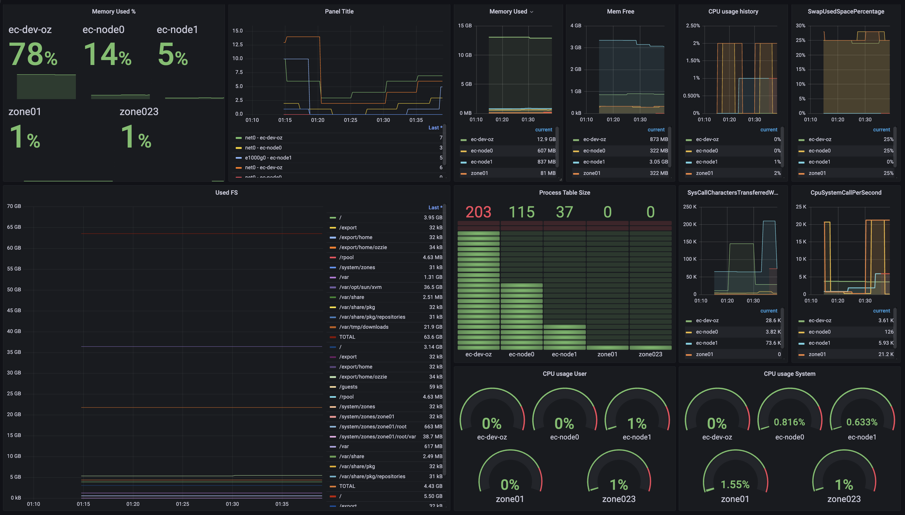

# ONYX Metric Exporter for Oracle OpsCenter 12C


NOTES: 
- private only


inject dari database


prometheus exporter


graphing with grafana

[sample prometheus config](/notes/prometheus.yml) update interval setiap 60 detik (1 menit)

```yaml
scrape_configs:
  - job_name: 'opscenter'
    scrape_interval: 10s
    scrape_timeout: 10s
    scheme: https
    metrics_path: /onyx/metrics
    tls_config:
      insecure_skip_verify: true
    static_configs:
      - targets: ['192.168.10.45:9443']
```      
